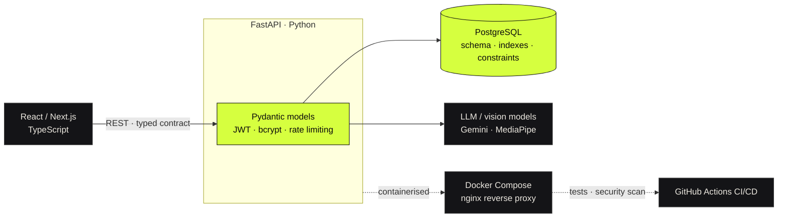

<div align="center">


<br>

**TG&nbsp;PRANAV&nbsp;HATHWAR** &nbsp;·&nbsp; Full Stack Developer &nbsp;·&nbsp; MCA @ RVCE, Bengaluru

<a href="mailto:pranav4hathwar@gmail.com"></a>
<a href="https://www.linkedin.com/in/pranav-hathwar"></a>
<a href="https://github.com/Pranav-Hathwar"></a>

</div>

---

```console
$ whoami --verbose

  name        TG Pranav Hathwar
  role        Full Stack Developer  ·  backend-leaning
  education   MCA @ RV College of Engineering, Bengaluru  (2025–2027)
  core        python · fastapi · sql · cloud · computer-networks
  ai          llm apis · rag · vector embeddings · vision models
  shipping    Mint Masala  →  attendance, menu analytics, inventory
  status      open to roles, internships & freelance

$ _
```

---

## `~/` how I build



---

## `~/` interview me on

<table>
<tr><td width="150"><b>Python</b></td><td>Primary language. Backend services, data pipelines, automation, and the glue around AI models — typed with Pydantic, tested, containerised.</td></tr>
<tr><td><b>FastAPI</b></td><td>APIs designed as a contract first: typed request/response models, dependency-injected auth, explicit status codes, generated OpenAPI docs.</td></tr>
<tr><td><b>SQL</b></td><td>Schema before endpoint. Normalised design, deliberate indexes, constraints that enforce invariants in the database rather than in application code.</td></tr>
<tr><td><b>Cloud</b></td><td>Containerised and deployed, never left on localhost. Docker Compose, nginx reverse proxy, GitHub Actions CI/CD with automated security scanning.</td></tr>
<tr><td><b>Networks</b></td><td>TCP/IP, DNS, TLS handshake, HTTP semantics, CORS, caching, latency — the difference between guessing at a <code>502</code> and diagnosing one.</td></tr>
</table>

> Everything else — MongoDB, Node, Express, React — I picked up because a project called for it. Productive in all of them; just not where my depth sits.

---

## `~/` stack

<div align="center">


<br>


</div>

---

## `~/` shipped

<details open>
<summary><b>Production &amp; near-production</b></summary>
<br>

| Project | What it does | Stack |
|---|---|---|
| **Hotel Management System**<br/>[`hms.mintmasala.in`](https://hms.mintmasala.in/login) | Staff attendance & operations for a live restaurant. RBAC, real-time tracking, automated reporting. **−40%** manual errors, **+50%** throughput. | `MongoDB` `Express` `React` `Node` |
| **[MenuMind Pro](https://github.com/Pranav-Hathwar/Menu_Engineering)** | Menu engineering SaaS. Classifies POS sales into a BCG matrix and simulates ±20% price moves against demand elasticity. | `FastAPI` `Python` `PostgreSQL` `Pandas` `Docker` |
| **Kitchenflow** | Inventory with a 12-stage approval workflow across 3 roles — chef request → owner approval → automatic stock write-back. **308 tests**, **90%** coverage, **38** CVEs closed. | `FastAPI` `PostgreSQL` `Docker` `Actions` |

</details>

<details open>
<summary><b>Engineering &amp; AI</b></summary>
<br>

| Project | What it does | Stack |
|---|---|---|
| **[VendorLens](https://github.com/Pranav-Hathwar/Socgen_Packetloss_hackathon)**<br/>[`live ↗`](https://socgen-packetloss-hackathon.vercel.app) | Third-party risk platform with a Gemini-backed audit chat. Canonical Pydantic models mirrored into the TS front end so schemas can't drift. | `FastAPI` `Gemini` `Next.js` |
| **[Wi-Fi Placement Optimizer](https://github.com/Pranav-Hathwar/CN-and-Math-EL_pranav)** | Finds the optimal indoor router position by modelling RF propagation — log-distance path loss, ray-cast wall attenuation, RSSI heatmaps. | `Python` `signal modelling` |
| **[Hand Signal](https://github.com/Pranav-Hathwar/Hand_Signal)** | Real-time gesture recognition from 21 tracked hand landmarks, with temporal smoothing for stability. | `MediaPipe` `OpenCV` `Python` |
| **[Chemical Virtual Lab](https://github.com/Pranav-Hathwar/chemical-vlab)** | Virtual chemistry lab for web + Android, built with a team for a professor in the chemical engineering dept. AES-256 encrypted answers, 100+ student sessions. | `Flutter` `Node` `PostgreSQL` |

</details>

<details>
<summary><b>Client &amp; freelance</b></summary>
<br>

- **[Mint Masala](https://mintmasala.in/)** — digital restaurant menu + the management system above, delivered end to end
- **[Munagru Homestays](https://home-stay-two.vercel.app)** — full site for a homestay business
- **[Swaathi](https://swaathi-portfolio-six.vercel.app)** — portfolio for a makeup artist *(in progress)*

</details>

---

## `~/` stats

<div align="center">


</div>

---

<div align="center">
<sub>Open to full-stack and backend roles, internships, and freelance — particularly anything with real operational weight behind it.</sub>
</div>
